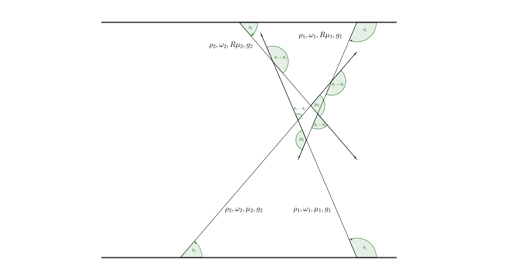

# neutrino-halo-problem

Parallel C++ code for neutrino halo problem.

## Neutrino Halo Problem

The first paper about this problem is

Cherry, J. F., Carlson, J., Friedland, A., Fuller, G. M., & Vlasenko, A. (2012). Neutrino scattering and flavor transformation in supernovae. Physical Review Letters, 108(June), 1–5. https://doi.org/10.1103/PhysRevLett.108.261104

The essense of the problem is that neutrinos might be scattered back and interfere with the oscillations on it's earlier path. Thus the neutrino oscillation problem becomes a Nonlocal Boundary Value Problem. Analytically the problem is very hard to solve. However, with numerical methods, it's somehow trivial.

This repositary provides an parallel (with OpenMP) algorithm to solve the neutrino halo problem. It might be a reference to those who are working on other Nonlocal Boundary Value Problems.

## Documentation

### Requirement

1. OpenMP is required
2. Boost is optional
3. C++11 standard

### Model

The model that we are solving is the line model.

### Solvers

1. `test.cpp` is the code to test the functions.
2. `neutrino-headon.cpp` demonstrates the solver `Looper::halo_euler_forward_one(sa_ptr, sa_store_ptr, STEPSIZE, SIZE, RCOEFF, MIU)` which solves the one beam problem.
3. `neutrino-headon-evo.cpp` demonstrates the solver `Looper::halo_evolution_op_one(sa_ptr, sa_store_ptr, STEPSIZE, SIZE, RCOEFF, MIU)` which uses the evolutation operator stepper and solves the one beam problem.
4. `neutrino-nunubar.cpp` demonstrates the solver `Looper::halo_euler_forward_one_nunubar(sa_ptr, sa_store_ptr, ya_sa_ptr, ya_sa_store_ptr, STEPSIZE, SIZE, spect, RCOEFF, mu_arr, costheta_arr)` which solves the two beams problem.
5. `neutrino-headon-avg.cpp` and `neutrino-headon-incline.cpp` are the two attemps to solve damp the oscillations and try to find the equilibrium with less iterations.

### Conventions

1. I use polarization vectors (flavor isospin picture) to denote the state of neutrinos.

### Two Beams Model Solver

In the code, I solved an example of the two beams model with left-going beam being neutrinos and right-going beam being antineutrinos.

The solver `halo_euler_forward_one_nunubar(StateArray* rho_array_ptr, StateArray* rho_array_store_ptr, StateArray* rho_another_array_ptr, StateArray* rho_another_array_store_ptr, const double dt, const int totallength, const double spectrum[2], const double reflection, const double mu_arr[2], const double costheta[4])` takes in many parameters.

1. The first two arrays are the left beam, and the next two arrays are the right beams.
2. `dt` is the stepsize.
3. `spectrum[2]` is the spectrum of the two beams. In fact this is simply the sign of the interactions. This is also used to determine the sign of :math:`\omega_v`. The first element should be the left beam and the second element should be the right beam.
4. `reflection` is the reflection coefficient. We have the same reflection coefficient for both beams regardless of the content since we are discussing neutral current scattering.
5. `mu_arr[2]` is {:math:`\mu_L`, :math:`\mu_R`}.
6. The angles `costheta[4]` parameters: { :math:`\cos(2 \theta_L)`, :math:`\cos(2 \theta_R)` , :math:`\cos( \theta_R- \theta_L)`, :math:`\cos (\theta_R+\theta_L)` }; **It might be better to use** :math:`\xi` **which is defined as** :math:`1-\cos(\text{whichever angles})`.

To be completed.

## Acknowlegement

Huaiyu Duan, my advisor, helped me a lot on C++ coding. Joshua Martin discussed and tested many of the interesting bugs and C++ facts.
